# EVERLYTICS_ANALYTICS_ENGINE ٩(◕‿◕)۶
> I'm an young engineer just wonder about idea on automation, feel free to contract me :>
> `I'm open for open source, community event also.`

**`EVERYLYTICS`** is the combine of word `"ever" & "analytics"`. Sound cool right **(ﾉ◕ヮ◕)ﾉ*:･ﾟ✧** seams like the only analytics tools for your app development. (App with GUI)

### Idea of an engine
Engine is an goal to create an solution for development, analytics team and production orchestrate team to have a common langue in business release. By those mean this idea will support piping the data to according analytic platform like `Firebase`, `Adobe`, `...` thorough SDK.

- Amount of time to develop analytics feature in app.
- GUI to design/export data form analytics tagging. 
- Cross programming langue supported base on [`dynamic invocation of Reflective`](https://en.wikipedia.org/wiki/Reflective_programming) an subset of meta programming [theory](https://en.wikipedia.org/wiki/Metaprogramming).

### Overall pseudo-diagram

```mermaid
sequenceDiagram
    autonumber
    participant analytic_teams
    participant EVERYLYTICS as EVERYLYTICS 👻
    participant development_teams
    Note over analytic_teams,development_teams: Quote: analytic is the only way to get user in app experience,<br/> which generate behavior into business value/opportunity
    analytic_teams->>development_teams: Hello teams, we've spec could you guys implement it asap?
    Note over EVERYLYTICS,development_teams: dev: Oh, and guess on future extension guys...?<br/>question hard to answer seen they're analytic teams<br/> leave un-context decision about two teams
    development_teams-->>analytic_teams: here you are, check those spec emit on the platform.
    Note over analytic_teams,development_teams: THE NEXT SPRINT
    analytic_teams->>development_teams: Guys new spec are here,<br/>could you update the old once and add more into them?
    Note over EVERYLYTICS,development_teams: Bruhhh, an spreed sheet with undocumented time-point on edit<br/> Your guys new way of gather data not fit<br/> with the current imp of the app
    analytic_teams->>development_teams: Anyway, could you guys `fix`it<br/>those are the required to help us build revenue for business
    loop
        development_teams-->>analytic_teams: refactor
    end
    analytic_teams->>development_teams: We find an platform allow us talk in an common language <br> here we could design/export <br>the spec for you guys
    analytic_teams->>EVERYLYTICS: design on the studio with corresponding analytic patterns
    EVERYLYTICS->>development_teams: We could use your exported and run that in the app
    Note over EVERYLYTICS,development_teams: Now we don't need to worry about new update<br/> seen we only need to load the files
```

### Road-map
Currently the road maps are:
- Support for Flutter/JS application `include packages, cli tools, code gen, class diagram`
- Develop ui for analytic tagging teams, allow them to design/export.
- Adaptor for other programming language. (or you could read the design and implement on the common interface)

#### WIP STILL WORKING ON DOCS STAY TUNE BY SUBSCRIBE 🔔